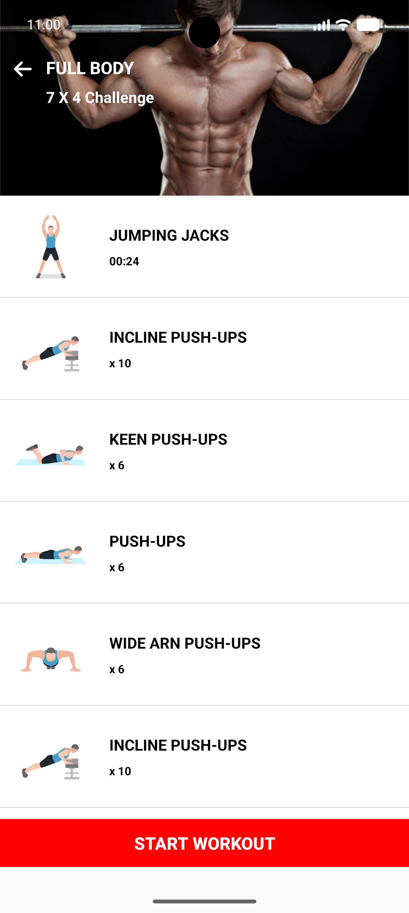
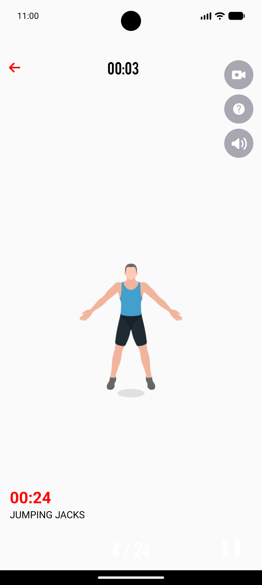

# Supercharged Fitness Application

An Android mobile fitness application designed to improve people's health and fitness lifestyles through their smartphones. This app encourages and teaches users how to perform various bodyweight exercises correctly.

## Screenshots

<p align="center">
  
  
  
</p>

## Features

- Multiple workout programs for different body parts and difficulty levels
- Exercise animations and instructions
- Timer for workouts and rest periods
- Text-to-speech functionality for exercise instructions
- YouTube video links for detailed exercise demonstrations
- User-friendly interface with easy navigation

## Technologies Used

- **Language:** Kotlin
- **UI Framework:** Android View System (XML)
- **Database:** Room Persistence Library (SQLite)
- **Architecture:** Model-View-Controller (MVC)
- **Dependency Management:** Gradle
- **Annotation Processing:** KSP
- **External Services:** 
    - Firebase (Analytics, Messaging, Performance Monitoring, Test Lab)
    - Google Play Services (Ads, Billing)
- **Libraries:**
    - Lottie (for animations)
    - Glide (for image loading)
    - Retrofit & Gson (for networking)
    - WorkManager (for background tasks)
    - CircularProgressIndicator

## Architecture and Design Patterns

- **Model-View-ViewModel (MVVM)** architecture for better separation of concerns and testability.
- **Factory Pattern** for creating exercise objects.
- **Repository Pattern** for data management (Room).
- **Observer Pattern** using LiveData/StateFlow for UI updates.

## Key Components

- HomeActivity: Displays workout categories
- WorkoutListActivity: Shows exercises in a selected category
- WorkoutActivity: Handles the execution of workouts
- NextPrevDetailsWorkoutActivity: Manages rest periods and navigation between exercises

## Installation

1. Clone the repository:
   ```
   git clone https://github.com/praiseOjay/Supercharged-Fitness.git
   ```
2. Open the project in Android Studio
3. Build and run the application on an Android device or emulator

## Usage

1. Open the app and select a workout category
2. Choose a specific workout from the list
3. Follow the on-screen instructions and animations to perform exercises
4. Use the timer to track workout and rest periods
5. Click the video button to view detailed YouTube tutorials for each exercise

## Testing

- Unit tests and UI tests are implemented using Firebase Test Lab
- Performance monitoring is done using Firebase Performance Monitoring
- Usability testing was conducted with volunteers to gather feedback

## Future Improvements

- Implement user profiles to track progress
- Add a feature to track calories burned during workouts
- Introduce more varied workout plans and exercises
- Implement social media sharing capabilities

## Contributing

Contributions to improve the application are welcome. Please feel free to submit issues or pull requests.

## License

This project is licensed under the MIT License - see the [LICENSE.md](LICENSE.md) file for details.

## Contact

Praise Ojerinola - ojerinolapraise@gmail.com

Project Link: https://github.com/praiseOjay/Supercharged-Fitness.git
